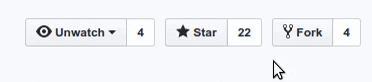

<p align="center">

</p>

<h5 align="center"> <b>Build Google Workspace add-ons in Python  🐍 !!!</b></h5>

<p align="center">
***
</p>

<div align="center">

[](https://github.com/skoudoro/gapps/actions?query=workflow%3ATest) [](https://pypi.org/project/gapps/) [](https://app.codacy.com/manual/skab12/gapps?utm_source=github.com&utm_medium=referral&utm_content=skoudoro/gapps&utm_campaign=Badge_Grade_Dashboard) [](https://opensource.org/licenses/MIT) [](https://github.com/skoudoro/gapps/blob/master/CONTRIBUTING.rst) [](https://github.com/skoudoro/gapps/compare)

</div>

<!-- <a href="https://codecov.io/gh/skoudoro/gapps"></a>  -->
<!-- <a href="https://github.com/skoudoro/gapps/graphs/contributors"></a> -->

---

## 📝 Table of Contents
<div style="background-color: #EBE8FC">

- [❗ What is GAPPS?](#what-is-gapps)
- [⚡ Key Features](#key-features)
- [🏁 Getting Started](#getting-started)
  - [🚜 Installation](#installation)
  - [⚙️ CardService: Choose your coding style!](cardservice-choose-your-coding-style)
  - [⛏️ Card Builder](#card-builder)
- [🚀 Demos](#demos)
- [💬 Tutorials](#tutorials)
- [📄 Methods Reference](#methods-reference)
- [⚠️ Notes](#notes)
- [✅ Tests](#tests)
- [✨ Contribute](#contribute)
- [🎓 License](#license)

</div>


## ❗ What is GAPPS?

**GAPPS**  is a library that allows developers to easily and flexibly build [add-ons for Google Workspace](https://developers.google.com/workspace/add-ons/how-tos/building-gsuite-addons) using Python 🐍. With **GAPPS**, you can create powerful tools and integrations for Gmail, Google Chat, Calendar, Sheets, Drive, Docs and other Google Workspace apps, that can streamline your workflow and automate common tasks.


## ⚡ Key Features

- A simple and easy-to-use API for building Google Workspace add-ons.
- Flexible interface that can be used for a variety of use cases.
- Built-in support for Gmail, Google Calendar, Google Drive and other Google Workspace apps.
- Well-documented, well-maintained codebase and easy to contribute.

## 🏁 Getting Started

### 🚜 Installation

This client is hosted at [PyPi](https://pypi.org/project/gapps/) under the name **gapps**, to install it, simply run

```terminal
pip install gapps
```

or install dev version:

```terminal
git clone https://github.com/skoudoro/gapps.git
pip install -e .
````

### ⚙️ CardService: Choose your coding style!

GAPPS allows you to build extensions by following your favorite coding style

<!--
 -->
#### Appscript Style

```python

def create_cat_card(text):
    # Use the "Cat as a service" API to get the cat image. Add a "time" URL
    # parameter to act as a cache buster.
    now = datetime.now()
    caption = text.replace('/', ' ')
    imageUrl = f'https://cataas.com/cat/says/{caption}?time={now.timestamp()}'

    image = CardService.newImage() \
        .setImageUrl(imageUrl)  \
        .setAltText('Meow')

    # Create a button that changes the cat image when pressed.
    # Note: Action parameter keys and values must be strings.
    action = CardService.newAction()  \
        .setFunctionName('on_change_cat') \
        .setParameters({'text': text, 'is_homepage': str(is_homepage)})

    button = CardService.newTextButton()  \
        .setText('Change cat')  \
        .setOnClickAction(action)  \
        .setTextButtonStyle(CardService.TextButtonStyle.FILLED)

    buttonSet = CardService.newButtonSet()  \
        .addButton(button)

    # Assemble the widgets and return the card.
    section = CardService.newCardSection()  \
        .addWidget(image)  \
        .addWidget(buttonSet)

    card = CardService.newCardBuilder()  \
        .addSection(section)

    return card.build()

```

#### Pythonic Style

```python

def create_cat_card(text):
    # Use the "Cat as a service" API to get the cat image. Add a "time" URL
    # parameter to act as a cache buster.
    now = datetime.now()
    caption = text.replace('/', ' ')
    imageUrl = f'https://cataas.com/cat/says/{caption}?time={now.timestamp()}'

    image = CardService.Image(image_url=imageUrl, alt_text='Meow')
    action = CardService.Action(
        function_name='on_change_cat',
        parameters={'text': text, 'is_homepage': str(is_homepage)})
    button = CardService.TextButton(
        text='Change cat', action=action,
        text_button_style=CardService.TextButtonStyle.FILLED)
    button_set = CardService.ButtonSet(button=button)
    section = CardService.CardSection(widget=[image, button_set])

    card = CardService.CardBuilder(section=section)

    return card.build()
```

#### ⛏️ Card Builder

The online [Card builder](https://gw-card-builder.web.app/) can help you prototype your app's interface.
## 🚀 Demos

Check out the [examples folder](https://github.com/skoudoro/gapps/tree/main/docs/examples) for sample codes. It contains the following examples:

- [cats.py](https://github.com/skoudoro/gapps/blob/main/docs/examples/cats.py): Mirror of google Cats example. Compatible with Gmail, Google Calendar, Google Drive, Google Docs and Google sheets
- [simple_demo.py](https://github.com/skoudoro/gapps/blob/main/docs/examples/simple_demo.py): minimalistic example to show how to build a basic card.
- [card_builder.py](https://github.com/skoudoro/gapps/blob/main/docs/examples/card_builder_templates.py): This example show how to reproduce all the templates from the online [Card builder](https://gw-card-builder.web.app/). It can help you prototype your app's interface.

## 💬 Tutorials

Coming soon...
## 📄 Methods reference

**CardService:** For the complete reference, visit the [official Google Workspace Add Ons API reference](https://developers.google.com/apps-script/reference/card-service).

## ⚠️ Notes

We still need to handle some widgets/builders but 90% of them are working correctly


## ✅ Tests

* Step 1: Install pytest

```terminal
  pip install pytest
```

* Step 2: Run the tests

```terminal
  pytest -svv gapps
```

## ✨ Contribute

We love contributions!

You've discovered a bug or something else you want to change - excellent! [Create an issue](https://github.com/skoudoro/gapps/issues)!

You've worked out a way to fix it – even better! Submit a [Pull Request](https://github.com/skoudoro/gapps/pulls)!

Start with the [contributing guide](https://github.com/skoudoro/gapps/blob/master/CONTRIBUTING.rst)!

## Do you like GAPPS?

Show us with a star on github...



## 🎓 License

Project under MIT license, more information [here](https://github.com/skoudoro/gapps/blob/master/LICENSE)
